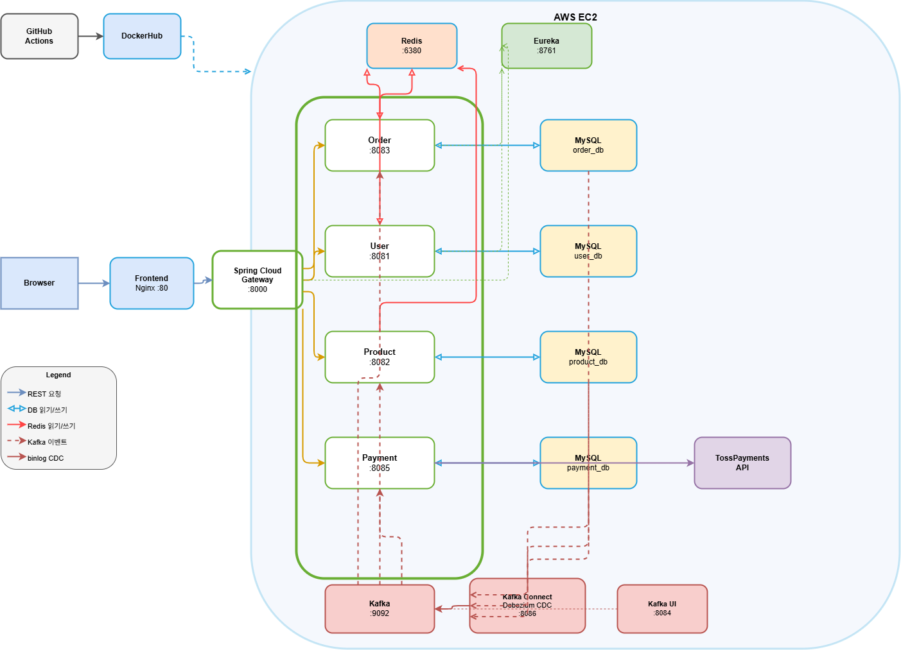
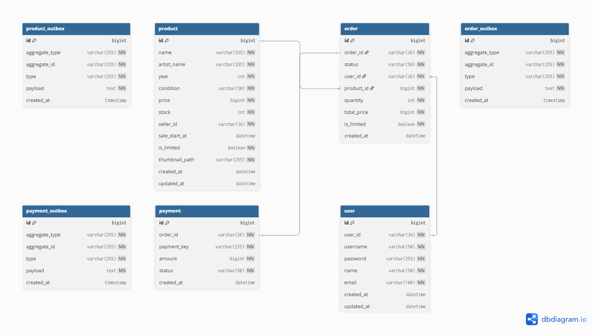
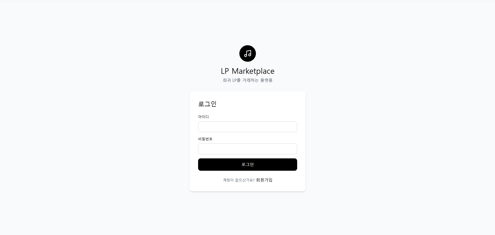
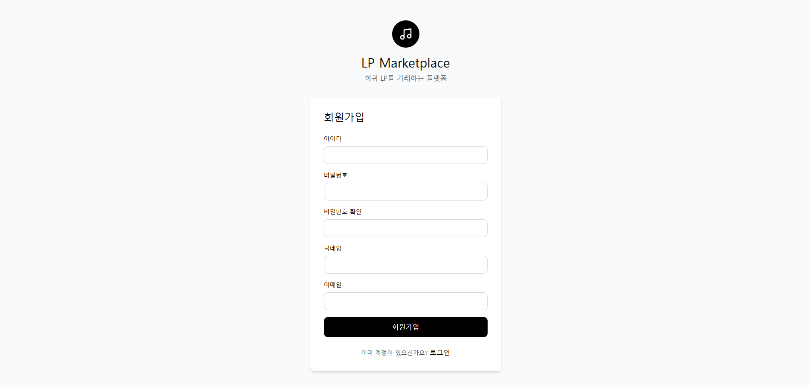
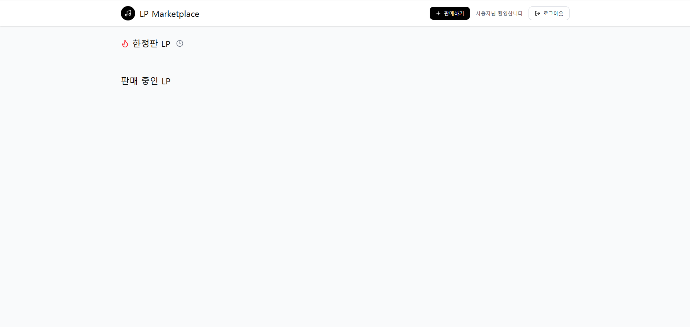
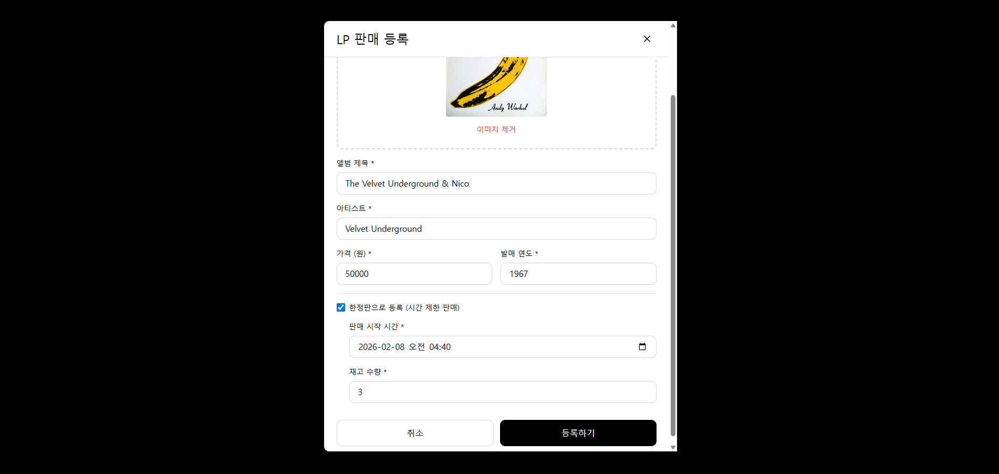
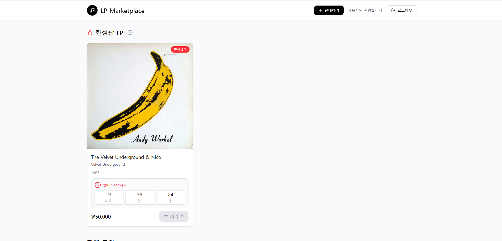
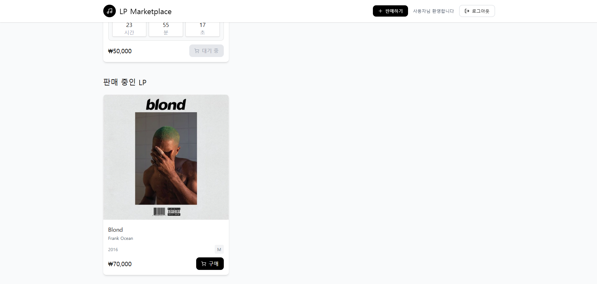
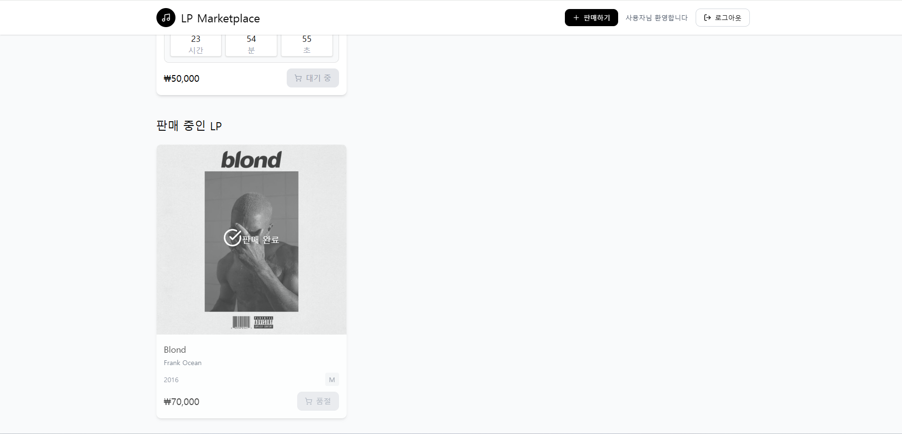

# lp-mall

# 목차
1. [프로젝트 개요](#1-프로젝트-개요)
2. [기술 스택](#2-기술-스택)
3. [시스템 아키텍처](#3-시스템-아키텍처)
4. [ERD](#4-erd)
5. [주요 기능](#5-주요-기능)

# 1. 프로젝트 개요

### 개발 기간
2026.01.29 - 2026.02.xx

### 프로젝트 소개
MSA 구조를 경험해보고자 진행한 프로젝트입니다.
간단한 쇼핑몰 사이트로, lp를 판매/구매할 수 있으며 원하는 시간에 판매가 시작되는 선착순 구매도 포함되어 있습니다.
api와 같은 추가적인 내용은 노션에 기록되어 있습니다.

[Notion](https://www.notion.so/lp-mall-2f614708c68b8186b28cfc40315a8693?source=copy_link)
# 2. 기술 스택
### Frontend
- React
- Vite
### Backend
- Java 17
- Spring Boot 3.5.10
- Spring Cloud
- Spring Data JPA
### Database
- MySQL
- Redis
### Message Broker
- Kafka

# 3. 시스템 아키텍처

# 4. ERD

# 5. 주요 기능
## 1. 로그인
JWT를 이용하여 구현

## 2. 회원가입

## 3. 판매중인 lp 목록
현재 판매중인 lp들이 한정판과 일반 제품으로 나뉘어 볼 수 있음

## 4. lp 판매 등록
원하는 제품을 판매 등록할 수 있음

한정판의 경우 판매 시작 시간을 설정하여 시간 전에는 구매가 불가능

## 5. lp 구매
구매를 한 경우 판매 완료 처리하여 구매를 못하게 함
